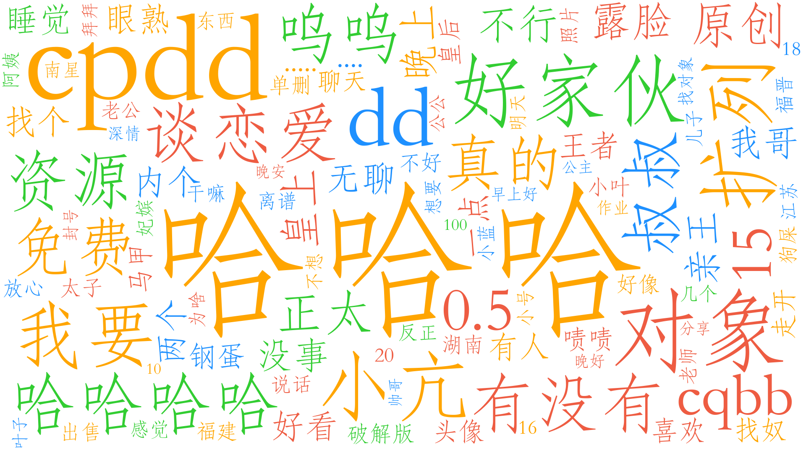

## 面向对话数据的事件聚类
采用依存句法分析对话文本当中的事件要素进行提取，形成SVO实体三元组。并送入BERT或LASER模型进行文本编码，采用SOM或DBSCAN对话题内容进行聚类，以形成特定的事件主题。

# 1.数据准备

/data/corpus.txt为话题数据，涉及AI、历史、金融、电影、科学、体育等方面。

数据来源：
- 对话系统中文语料：https://github.com/candlewill/Dialog_Corpus

# 2.环境准备
2.1 python环境
```
pip install -r requirements.txt
```
2.2 BERT模型
```
百度网盘（提取码wngt）：https://pan.baidu.com/s/1x-jIw1X2yNYHGak2yiq4RQ?pwd=wgnt
```

# 3.项目运行
3.1 运行前提

修改feature/BERT/config下的BERT模型路径

3.2 程序运行
```
python main.py
```

# 4.话题发现（lgbd群聊）

4.1 词频统计法（常规分词）

带星为话题词汇
```
哈哈哈 304
*cpdd 156
*对象 63
dd 59
扩列 51
好家伙 49
小亢 48
我要 41
哈哈哈哈 38
*谈恋爱 36
有没有 35
资源 35
呜呜 34
叔叔 34
免费 32
*0.5 31
真的 30
*cqbb 30
15 29
原创 29
正太 29
露脸 28
皇上 28
不行 27
晚上 26
亲王 24
没事 22
我哥 21
无聊 20
```

词云效果



4.2 领域术语抽取

采用词性方式，获取领域术语，挖掘可能的话题内容：
```
'奴下_奴嘛', '路人_队友', '明人_朋友圈', '哥_眉毛', '蛆_蛆', '皇四子_生母', '网站_浏览器', '处_对象', '哥帅_男', '卧槽_土豪', '免费_免费', '烧纸_钱', '老公_老公', '白_衣服', '意思_意思', '头_码头', '宇宙_大花',
'食堂_粥', '门票_手机', '弟弟_词汇量', '喉结_锁骨', '胯下_亡魂', '动作_消息', '软件_游戏', '情侣_头像', '有点_小钱', '鲶鱼_姐姐', '省_省', '狗屎_老师', '大家_形容', '麻药_药', '榜首_小号', '小时候_皮实', '皇上_兄弟',
'阿巴_阿巴', '小号_榜', '家庭_弟位', '柜柜_交友', '群主_对象', '原_神光', '大_情种', '锁骨_腹肌', '儿子_生娃', '妈_筷子', '武汉_东西', '蟹_蟹', '成人_玩具', '腰眼_胸肌', '鸡_王者', '大渣_男', '时候_心眼', '问问_问', 
'玩次_王者', '皇_皇上', '成都_郫县', '禁言_套餐', '论洁娃_自带', '内_骨头', '家庭_狗血', '要点_脸', '会长_皱纹', '小肚_心肠', '房_都行','题盘_逻辑', '群主_耗子', '美女_姐姐', '狗_粮', '老色_胚', '东西_湖', '区_变天', 
'动漫_头像', '爷爷_内种', '杖_责', '学_声乐', '叔叔_晚安', '卡哇_卡', '擦边_啥意思', '有点_参与感', '乒乓球_校队', '离谱_剧', '狗屎_作业', '么_么', '饭_差点', '谢谢_谢谢', '问问_群主', '地方_喉结', '泥鳅_姐姐', '老_变态', 
'风纪_委员', '会儿_语音', '狼_人', '耗子_耗子', '反一_波', '檀_健', '手筋_脚筋', '方块_制裁', '狗_儿子', '腰子_太小', '家庭_地位', '品味_情头', '草_土豪', '给你个_妃位', '亲王_出场', '资源_全包', '曦_宇', '时候_家庭', 
'四川_凉山', '腹肌_人', '叔叔_真凶', '群里_视频', '内_二炮', '玩玩_手机', '群_好色', '么_鹿鹿', '破解版_软件', '小_报告', '社交_牛', '小_胖子', '眼光_生物', '兄弟_情深', '瓜子_饲料', '真_过分', '辣条_腮帮子', '初中生_高中生', 
'宴_宝艾特', '口区_男', '传统_手艺', '背景_照', '线_头子', '骨灰盒子_长方体', '卧槽_牛', '散伙_散伙', '奶_狗', '单身_狗', '食堂_饭', '网_课', '刀_指向', '土豪_土豪', '宴宴_对象', '肌肉_离谱', '人_意思', '萱狗_怡崽', '干画_手抄报', 
'欧克_欧克', '部_家庭', '蚕蛹_内五', '谢谢_帅哥', '腮帮子_麻', '网站_破解版', '皇后_娘娘', '哥_房间', '尺子_量', '公式_噻', '原创_视频', '色色_图发班群', '人_话', '回家_烧纸', '高端_作文', '照片_球球', '鱼线_腰眼', '人缘_真差', '个人_意愿', 
'手机_口罩', '云_箭', '皇上_礼重', '槟榔_姐', '人_鱼线', '做人_证', '影响_发育', '尺量_过', '资源_事', '螺旋_狗', '钢丝_球丝'
```

4.3 三元组抽取
针对lgbd对话数据进行三元组抽取，发现句子结构不完整，三元组信息较难获取。
```
三元组  句子
[] 扩列加我
[['谈恋爱1', '加', '我']] 谈恋爱的1加我
[] 加我给看
[] 看啥啊
[] 看啥
[] 嗨
[] 哈哈哈
[] 看啥
[] 我可爱的孩子们
[] 看看
[] 好家伙
[] 我新的气泡
[] 是不是很可爱
[] 这个猫猫还会动
[] 不
[['你字', '是', '有颜色的']] 至少你的字是有颜色的
[] 没看到
[['你', '看', '你看你看这个小只'], ['你', '看', '你看这个小只'], ['你', '看', '这个小只']] 你看你看你看这个小只
[['一群人', '都是', '白色字']] 一群人都是白色的字
[] 看的费眼
[] 。。
[] 。
[] 看！
[] 哈哈哈哈哈
[] 这个猫猫是不是很可爱
[] 好家伙的
[] 不
[] 可爱吗
[] 你滚
[] 走开走开
[] ？！
[] 突然就不可爱了
[] 蛤
[] 为什么变成这么……方一只
[] 突然就不可爱了
[] 有帅哥吗
[] 看来还是不要回复的好
[] 没有
[] 真的啊
[] 真的没有
[] 哈哈哈
[] 完了……这只猫看起来好奇怪
[] 没事
[] 奶1啊多奶啊
[] 好方……
[] 看看照片
[] 你滚
[] woc排骨
[] 过分了
[] 小亢 好受
[] 哎呀嘿
```

4.3 聚类分析

采用DBSCAN、SOM等聚类方式对文本内容进行话题聚类，并挖掘内容特征
